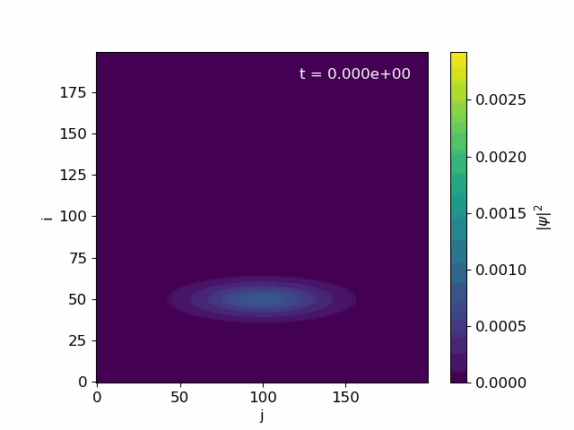

# Wave Dynamics through Slits --- A Memory-Efficient Stencil Scheme

## Description
This repository contaions a 2D solver for the time-dependent Schrödinger equation in slit potentials to study the classical double-slit experiment and related setups. The simulation focuses on the double slit experiment, demonstrating wavefunction evolution and interference patterns. 

The core is a matrix free Crank-Nicolson scheme solved with red-black Gauss-Seidel or Jacobi iterator. One of our main focuses is on how to implement Crank-Nicolson without forming large matrixes and doing heavy linear algebra, but use stencil formulas. 

Simulations are configured via JSON files, and are supported by Python scrips to generate animations, probability conservation plots, and detection screen distributions used in the report.


## Physical Model
The time-dependent Schrödinger equation in two dimensions is given by:


$$
\mathrm{i}\hbar \frac{\partial \Psi(x,y,t)}{\partial t} = -\frac{\hbar^2}{2m} \left( \frac{\partial^2 \Psi(x,y,t)}{\partial x^2} + \frac{\partial^2 \Psi(x,y,t)}{\partial y^2} \right) + V(x,y) \Psi(x,y,t)
$$

or in dimensionless units:

$$
u_t = \mathcal{L}u
$$

where

$$
\mathcal{L} = \mathrm{i}\mathbf{\Delta} - \mathrm{i} V(x,y)
$$
and
$$
\mathbf\Delta \equiv \left(\frac{\partial^2}{\partial x^2} + \frac{\partial^2}{\partial y^2}\right), \quad u_t \equiv \frac{\partial}{\partial t}u.
$$
We initialize the wavefunction as a Gaussian wave packet:
$$
u(x,y,t=0)= \exp\left[-\frac{(x-x_c)^2}{2\sigma_x^2}-\frac{(y-y_c)^2}{2\sigma_y^2}+ ip_x x + ip_y y\right].
$$
We also impose a normalization constraint such that
$$
\|u\|_2 = 1.
$$
and Dirichlet boundary conditions on the edges of the box domain. 

We discretize this into $v_{ij}^n$ in the natural way, with the caveat that our discrete wavefunction is normalized as
$$
\|v\|_{2,h}^2 = \langle v, v \rangle_h = \sum_{i,j=0}^{M-1} |v_{ij}|^2 = 1,
$$
omiting the $h^2$ factor. We then interpret $|v_{ij}^n|^2$ as the probability at grid point $(i,j)$ and time step $n$, not the probability density.


## Simulation and Method
We discretize the spatial domain into a grid of size $M \times M$ with spacing $\Delta x = \Delta y = L / (M-1)$, where $L=1.0$ is the length of the box domain. The time domain is discretized into $N$ time steps with step size $\tau$. Our implementation uses the Crank-Nicolson method. We do not form large matrices, but rather use stencil formulas. The linear system is solved iteratively using the red-black Gauss-Seidel method. Jacobi method is also implemented if wanted. 

Our scheme is convergent and stable for all time steps, grid sizes, and potential configurations tested. However, the iterative solver requires a real potential to converge properly. It also converges more slowly for larger grids, and smaller potentials. The relative error and maximum iterations can be adjusted as needed. 

## Animation of $|v_{ij}^n|^2$ for increasing $T$

Double slit similation running for $T=0.008$ using the config example `config.json` listed below. Note the animation is of the full probability propagation $|v_{ij}^n|^2$ not $|v_{ij}^n|$.
## Project Structure
```text
Project5/
├── Makefile                 # Build targets for solver binaries and helpers
├── README.md                # Project overview and usage notes
├── PROJECT_PLAN.md          # Internal scope/timeline notes
├── configs/                 # JSON configs for reproducible runs
│   ├── configs.json         # Default double-slit run
│   ├── double_slit.json     # Two-slit configuration
│   ├── no_slit_p7.json      # Closed-wall baseline
│   ├── single_slit.json     # Single-slit configuration
│   ├── slit_p7.json         # Variant slit setup
│   └── triple_slit.json     # Three-slit configuration
├── include/                 # C++ headers
│   ├── constants.hpp        # Common typedefs and constants
│   ├── io.hpp               # JSON parsing and I/O helpers
│   ├── potential.hpp        # Potential builders (walls, slits, harmonic)
│   └── solver.hpp           # Crank-Nicolson solver interface
├── src/                     # C++ implementations
│   ├── io.cpp               # JSON -> params and file writing
│   ├── main.cpp             # Entry point for running simulations
│   ├── matrix_printer.cpp   # Builds/prints A,B matrices for reporting
│   ├── potential.cpp        # Potential and slit-mask construction
│   └── solver.cpp           # Time stepping and iterative linear solves
├── bin/                     # Compiled executables (generated)
│   ├── ds_solver            # Main simulation binary
│   └── matrix_printer   # Matrix builder/printout utility
├── scripts/                 # Python analysis and visualization
│   ├── animate.py           # Probability-density animation
│   ├── detection_prob.py    # Detection probability over time
│   ├── io_python.py         # File-loading helpers for outputs
│   ├── plot_snapshots.py    # Save snapshot frames
│   └── plot_total_prob.py   # Probability conservation check
├── output/                  # Simulation outputs (generated)
│   ├── wavefunction_2slit.txt # Example wavefunction dump
│   └── figures/
```

## Installation and Dependencies


- **C++20 compiler** (e.g. g++ 11 or higher)
- **OpenMP** 
- **Python 3.10+**
- **nhlomann/json** (header-only C++ JSON library) - included in    `include/` folder
  - `numpy`
  - `matplotlib`


### Ubuntu/Debian
```bash
sudo apt update
sudo apt install g++ make libarmadillo-dev python3 python3-pip
pip3 install numpy matplotlib
```

Other systems not tested, but should work with similar steps.


## Usage & Compilation
To see how make targets are defined, check the `Makefile` or run:
```bash
make help
```

### Using JSON config files


**Example**
Double slit from `config.json`
```json
{
    "grid" : {
        "M" : 200,          # number of grid points in x and y
        "L" : 1             # length of box domain
    },
    "simulation" : {
        "N" : 321,           # total number of time steps t0, ... tN
        "dt" : 2.5e-5,      # time step size
        "xC" : 0.25,        # x center of initial wave packet
        "sigma_x" : 0.05,   # standard deviation in x
        "px" : 200,         # initial momentum in x (wavenumber for unitless)
        "yC" : 0.5,         # y center of initial wave packet
        "py" : 0,           # initial momentum in y (wavenumber for unitless)
        "sigma_y" : 0.2     # standard deviation in y

    },
    "output" : {
        "file_name" : "output/probability_.txt",                  # file for probability density output (not used, to use uncomment in solver.cpp)
        "file_name_wavefunction" : "output/wavefunction_.txt",   # file for wavefunction output    
        "precision" : 8                                                     # output precision
    },
    "solver" : {
        "method" : "gauss_seidel",     # solver method (only jacobi/gauss_seidel implemented)
        "tolerance" : 1e-10,      # solver tolerance for jacobi
        "max_iterations" : 2000  # max iterations for jacobi
    },
    "potential" : {
        "type" : "none",         # type of base potential (none, harmonic)
        "frequency" : 1.0,       # frequency for harmonic potential
        "V0" : 1e10              # potential strength for double slit wall
    },
    "slits" : { 
        "enabled" : true,        # enable/disable slits
        "wall_center" : 0.5,     # center position of wall in x
        "wall_thickness" : 0.02, # thickness of wall in x
        "slit_aperture" : 0.05,  # aperture of slits
        "num_slits" : 2,         # number of slits
        "slit_spacing" : 0.05    # spacing between slits
    },
    "parallelization" : {
        "threads" : 12          # number of OpenMP threads
    }
}
```

**Caveats**

**Simulation**
- Describes initial gaussian wavepacket. 
- Only Dirichlet BC implemented.

**Potential**
- Harmonic potential was only used for testing, so may not be fully functional.

**Solver**
- Only the Jacobi iterative method is implemented. 
- Slow convergence for large grids. 
- Gives larger errors at first time steps. 
- max_iters is per time step.
- tolerance is the maximum change at any grid point.

**Slits**
- The slits are spaced uniformly around the center of the wall with equal spacing.
- The total width of all slits and spacings must fit within the wall thickness. There is no test for this, so be careful.
- If the wavepacket is initialized over the wall, unexpected behavior may occur.
  

### Compile
To compile the code to `bin/`, use:
```bash
make all
```

### Run
To run with the basic config file `config.json`:
```bash
make run
```
To run with spesific config file:
```bash
./bin/ds_solver configs/<file>
```
To print out a simple $ m\times m $ matrix:
```bash
make run-printer
```


## Plotting

- The scripts read `output/wavefunction_*.txt` produced by simulations. Edit the filename variables in each script for your run. All figures saves PNG to `output/figures/`
- Animate probability density to GIF (defaults to `output/wavefunction_.txt`):
  ```bash
  python3 scripts/animate.py
  ```
- Probability conservation check (defaults to `wavefunction_slit_p7.txt` and `wavefunction_no_slit.txt`):
  ```bash
  python3 scripts/plot_total_prob.py
  ```
- Detection screen distribution at `x_screen`. Adjust `filename_siffices`, `dt`, `T` and `L` according to generated the used config file. (defaults to `wavefunction_{1slit,2slit,3slit}.txt`):
  ```bash
  python3 scripts/detection_prob.py
  ```
- Snapshots of $|\Psi|^2$, Re(psi), Im(psi) at selected times. Adjust `T` for snapshots at different times.         (defaults to `wavefunction_2slit.txt`):
  ```bash
  python3 scripts/plot_snapshots.py
  ```

### Important parameters to reproduce report figures

All other parameters not listed are unchanged from the example `config.json`.

| Plot / figure                                | Simulation command(s)                                                                                             | Plotting script                          | Key parameters / notes                                                                                                  |
|---------------------------------------------|--------------------------------------------------------------------------------------------------------------------|------------------------------------------|-------------------------------------------------------------------------------------------------------------------------|
| Total probability (free propagation)        | `./bin/ds_solver configs/no_slit_p7.json`                                                                          | `python3 scripts/plot_total_prob.py`     | `N = 321`, `sigma_y = 0.05`, `V0 = 0`.                                                                                  |
| Total probability (double slit)             | `./bin/ds_solver configs/slit_p7.json`                                                                             | `python3 scripts/plot_total_prob.py`     | `N = 321`, `sigma_y = 0.1`, `V0 = 1e10`, two slits.                                                                    |
| Snapshots (Re/Im and \|Ψ\| at t = 0, 0.01, 0.02) | `./bin/ds_solver configs/single_slit.json` and `./bin/ds_solver configs/double_slit.json`                        | `python3 scripts/plot_snapshots.py`      | `N = 81`, `sigma_y = 0.2`, `V0 = 1e10`, `slits = {1,2}`. In Python: `T = {0.0, 0.001, 0.002}`.                         |
| Detection screen distributions              | Run single/double/triple slit configs: `./bin/ds_solver configs/single_slit.json`, `double_slit.json`, `triple_slit.json` | `python3 scripts/detection_prob.py`      | `N = 81`, `sigma_y = 0.2`, `V0 = 1e10`, `slits = {1,2,3,8}`. For 8 slits: adjust `num_slits` to 8 in one config. In Python: `T = 0.002`, `x_screen = 0.8`, `L = 1.0`. |
| Animation in README.md                      | `./bin/ds_solver configs/config.json`                                                                              | `python3 scripts/animate.py`             | `N = 321`, `sigma_y = 0.2`, `V0 = 1e10`, two slits.                                                                    |


## Future work
* GPU parallellization. 
* Better iterative solvers
* More potential configurations.
* Adaptive time steps.
## Declaration of Use of Generative AI

In this scientific work, generative artificial intelligence (AI) has been used. All data and personal information have been processed in accordance with the University of Oslo’s regulations, and we, as the authors of the document, take full responsibility for its content, claims, and references. An overview of the use of generative AI is provided below.

**Summary**

- **Tool(s) used:** [OpenAI ChatGPT (GPT-5)](https://chatgpt.com/)
- **Use:**
  - Generating boilerplate code (e.g., plotting with `matplotlib`).
  - Generating Makefiles.
  - Formatting `README.md`.
  - Checking language for clarity and grammar; general proofreading.
  - Generating brief code documentation, comments, and variable names to improve readability and adhere to conventions.
  - Creating tables in proper TeX format.
  - Brainstorming ideas for code optimization and efficiency.
